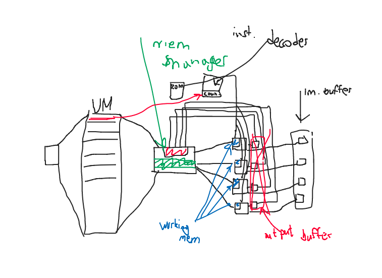

# GPU for Z80 based on FPGA

## Idea of project
Tha main purpose of this project is to create general purpose video card using FPGA techs.
This project is part of bigger project - computer based on Z80.
In this project is used DE10-nano Cyclone V FPGA.

## Product requirements
- compatible with Z80
- general purpose (capability to program it)
- cuda-like architecture
- video output to VGA or\and hdmi
- 64 16 bit simple cores
- special simple assembler

## Details on realization
### memory
- "memory remapping" - data distribution between cores
   (number of core that will get i piece of data - i%{number of used cores})) This has to be implemented by us
- There is MMU that helps for Z80 to write into memory with bigger then 16bit address space. This is imple,ented by other people.
- Video ran itself is also an output memory. 
- when coding, programmer can choose, where he wants to save result. When coding assembler, programmer can specify arrays from what addresses to take arrays, and where to save but there are some restrictions: 
    1) Arrays have to have the same size
    2) result have to have the same size as arrays
    3) arrays have to have first address = 0 mod 64 (numbers of cores)
    4) first result's address has to be 0 mod 64
- There is image buffer, where each core can write. There will be special chip that will trnasfer this data to the hdmi/vga
#### memory architecture:

### instruction execution cycle
- cores are stupid and have very simple set of instructions (ariphmetics (adding, multiplication), binary operators, memory operations)
- There is ROM memory, where live shaders
- Processors sends address of shader for working, to special controller, that will fetch instructions from ROM and send them to cores or will do some "personal" logic (cycle, if branches????) 
#### memory + ROM architecture

