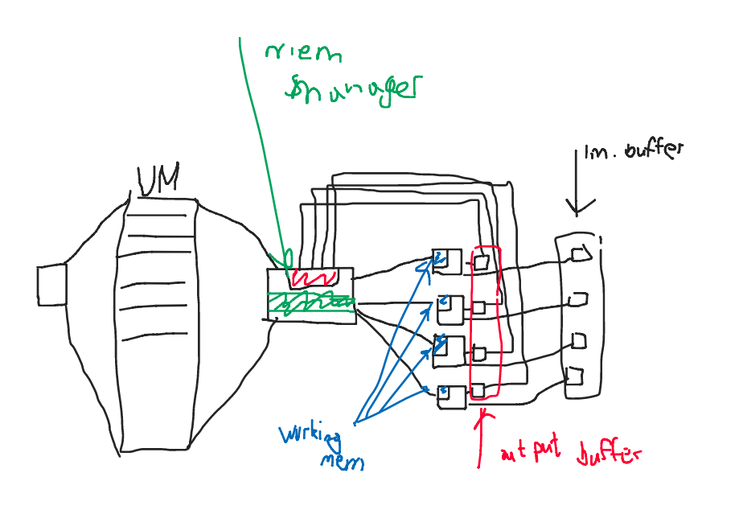

# GPU for Z80 based on FPGA

## Idea of project
Tha main purpose of this project is to create general purpose video card using FPGA techs. 
This project is part of bigger project - computer based on Z80. 
In this project is used DE10-nano Cyclone V FPGA.

## Product requirements
- compatible with Z80
- general purpose (capability to program it)
- cuda-like architecture
- video output to VGA or\and hdmi
- 64 16 bit simple cores
- special simple assembler

## Details on realization
### memory
- "memory remapping" - data distribution between cores
   (number of core that will get i piece of data - i%{number of used cores})) This has to be implemented by us
- There is MMU that helps for Z80 to write into memory with bigger then 16bit address space. This is imple,ented by other people.
- Programmer has to make programs, keeping in the mind some restrictions. 
    1) if you want to add two arrays, you have to devide you arrays into pieces of size of 64 numbers, and write one devided piece by one(e.g. first 64 numbers of first array - first 64 numbers of second array - second 64 bit of first array -...)
    2) size of videoram is limited

#### memory architecture:

### instruction execution cycle
...
#### memory + ROM architecture

