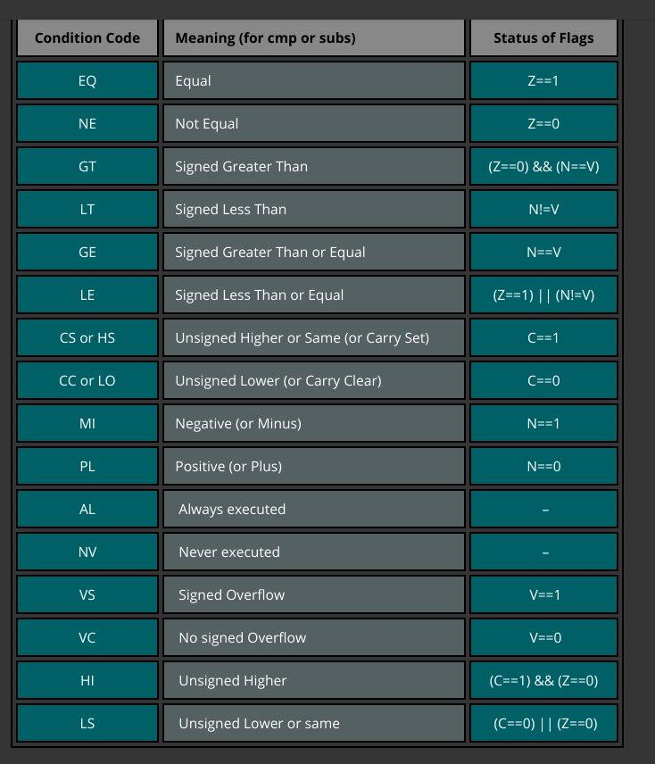

# GPU for Z80 based on FPGA
## Link to presentation
[here](https://docs.google.com/presentation/d/e/2PACX-1vQRQlCamovF6Binl2SsoKEvrqsEsJz2ccPZm9A6kuHSVUr-em4yzhscMbtGglOLyyb3eJqYMeQPTMkx/pub?start=false&loop=false&delayms=3000)
## Idea of project
Tha main purpose of this project is to create general purpose video card using FPGA techs.
This project is part of bigger project - computer based on Z80.
In this project is used DE10-nano Cyclone V FPGA.

## Product requirements
- compatible with Z80
- general purpose (capability to program it)
- cuda-like architecture
- video output to VGA or\and hdmi
- 64 16 bit simple cores
- special simple assembler
- instruction processor for loops and simple branches

## Details on realization
### memory
- "Memory remapping with modulus 64 (number of cores)" - data distribution between cores (Memory manager does distribution). But memory manager also mapps instruction processor IP and reg0-3
- There is MMU that helps for Z80 to write into memory with bigger then 16bit address space. This is implemented by other people.
- Video mem itself is also an output memory. - processor can read from video mem through memory manager
- When coding, programmer is almost free at actions: programmer can specify arrays from what addresses to take arrays, and where to save but there are some restrictions:
    1) Arrays have to have the same size
    2) Input arrays and result array have to have first address = 0 mod 64 (numbers of cores)
    3) When preparing data for videocard, coder has to realize that videocard works with 16-bit numbers, so programmer has to prepare 16-bit numbers (each into two RAM cells)
- There are 2 video buffers, one is shown on screen, second is being written by cores
  The videocard is working in the main memory, and while creating video frame all writing into main memory are made also on the selected buffer. Second buffer is procedded by vga controler. Then the switch is made and videocard writes in second buffer, but first is used for VGA. So actually two buffers are divided betwen 64 cores, and actually there are 2 * 64 buffers.

### instruction execution cycle
- cores have smaller set of instructions (arithmetics (adding, multiplication), binary operations, memory operations) - no branching (thanks to SIMD)
- There is ROM memory, where live shaders
- There is special memory cell that is directly mapepd into IP of instruction processor. Also its registers (there are 4 of them) are mapped in VM. They can be used as arguments for shader.
- Note, instruction processor only fetches instruction and sends them to cores. But there are special instructions for manipulating its registers - The main purpose is to implement cycles and if - branches, that include only values of registers (instruction processor doesn't have a memory)
- When someone else is writing into IP (processor through VM) then videocard is going into execution state (special flag will be changed). After finishing function, videocard starts execution NOP, and at this moment, flag is changed) This flag will inform processor if videocard have finished its job.
### Overall arch

### Buffers

### Instruction execution

### Кодування інструкцій TODO: перекласти і оформити по людськи

Кодування регістра флажків
[carry_flag, neg_flag, zero_flag, overflowe_flag, signed_flag]

1	- тип інструкції (ядра / процесор)

1	- алу інструкція  / решта

1	- АЛУ: тип інст 0 / НЕАЛУ: 0

1	- АЛУ: тип інст 1 / НЕАЛУ: 1

1	- АЛУ: тип інст 2 / НЕАЛУ: 2

1	- АЛУ: тип інст 3 / НЕАЛУ: 3

1	- АЛУ: суфікс 0	/ НЕАЛУ: 4	/ mov0-1 load0-1 store0-1

1	- АЛУ: суфікс 1		/ число для мувів

1	- АЛУ: суфікс 2		/ число для мувів

1	- АЛУ: суфікс 3		/ число для мувів

1	- АЛУ: сорс дест 0		/ число для мувів

1	- АЛУ: сорс дест 1		/ число для мувів

1	- АЛУ: сорс дест 2		/ число для мувів

1	- АЛУ: сорс дест 3		/ число для мувів

1	- АЛУ: сорс дест 4(ядра) / число для мувів

1	- АЛУ: сорс дест 5(ядра) 

в instruction processor 8 регістрів. (2 - ip and sp, 6 gp)

В ядрах 4 регістри, 2 біти вказують на destination регістр, а перші 4 на операнди

add r0, r2 (instruction processor)

add r0, r0, r2 (cores)

АЛУШНІ інструкції  
4 біт (16) addi addci subi subci muli mulci  |   andi ori xori noti lshi rshi  |  cmpi inci deci 

ДЛЯ ВСІХ алушних 4 біти на суфікси

НЕАЛУШНІ інструкції  5 біт

Лише для mov, load, store 4 біти на суфікси, для інших не алушних немає суфіксів

5 bits (32): movl(0-5), movh(0-5), movf(0-5), mov0-1, load0-1, store0-1,  je, jne jgt jge jlt jle
(chmod, chbuf)

“0-1” в кінці вказує перший біт кодування суфікса

Список суфіксів:

