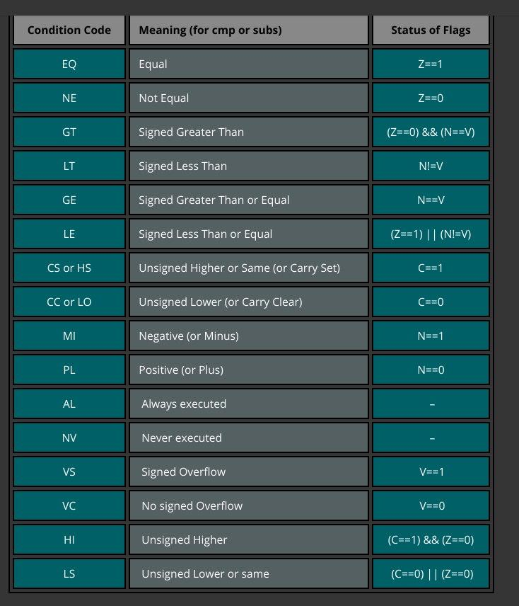

# ISA documentation of our videocard cores
*neeeds update*

## General things
- There are 8 registers, reg0-reg7
- reg6 = sp; reg7 = ip
- All registers are 32bit
- All instructions are 16bit (except for movl/movh that are 32bit)
- ISA is strict RISC, so the memory model is load-store
- There is flag register [CARRY, SIGN, OVERFLOW, ZERO]
- The address bus is only 16bit (even  though  you can put 32bit number into register).
- Each core knows it's index through ```coreidx op1``` instruction
- At the end of program, you should call interrupt with code 1 (```int 1```)
- If jump instruction is in even address in ROM, then assembler puts NOP after jump, becase instruction after jump is always executed
- If 32-bit instruction is in odd address in ROM, then assembler puts NOP before it, because when half of 32bit instruction is loaded in core - that's undefined behaviour.
- There is no (yet) hardware support of mutexes, so be carefull

## Instructions

### ALU-related instructions
**Arithmetics 2-operands**
- add op1 op2  - op1 += op2
- addc op1 op2 - op1 += op2 + CARRY_FLAG
- sub op1 op2  - op1 -= op2
- subc op1 op2 - op1 -= op2 + CARRY_FLAG
- mul op1 op2  - op1 *= op2
- div op1 op2  - op1 /= op2
- cmp op1 op2  - does op1 - op2, but saves only flags

**Arithmetics 1-operand**
- inc op1      - op1++
- dec op1      - op1--

**Logic 2 operators**
- and op1 op2 - op1 &= op2
- or op1 op2  - op1 |= op2
- xor op1 op2 - op1 ^= op2
- lsh op1 op2 - op1 <<= op2
- rsh op1 op2 - op1 >>= op2

**Logic 1-operator**
- not op1     - op1 = ~op1

### Moves
- mov op1 op2               - op1 = op2
- movl op1 <uint16 number>  - op1[15:0] = <number>
- movh op1 <uint16 number>  - op2[31:16] = <number>
- movf op1                  - op1 = flag register

### Memory
- load op1 op2  - op1 = RAM[op2]
- store op1 op2 - RAM[op2] = op1

### Jumps
- je op1  - jump if equal            - ip = op1 if ZERO_FLAG==1
- jne op1 - jump if not equal        - ip = op1 if ZERO_FLAG==0
- jgt op1 - jump if greater then     - ip = op1 if ZERO_FLAG==0 && OVERFLOW_FLAG==SIGN_FLAG
- jge op1 - jump if greater or equal - ip = op1 if OVERFLOW_FLAG==SIGN_FLAG
- jlt op1 - jump if less then        - ip = op1 if OVERFLOW_FLAG!=SIGN_FLAG
- jle op1 - jump if less or equal    - ip = op1 if ZERO_FLAG==1 && OVERFLOW_FLAG!=SIGN_FLAG
- jmp     - jump always              - ip = op1

### Others
- coreidx op1 - op1 = coreidx
- int int_num - call interupt with given 3-bit number. Yet implementer only 1 - core finished its job, stop working.

## Some features

### Suffixes
All instructions except for jumps, movf support suffixes. This is 2 letters at the end of the instruction. Basically the instruction will be executed if some condition is satisfied. It's like one-instruction if statement. Idea is stolen from ARM ISA


Here is the list of suffixes, and the conditions to be satisfied:



### Instruction coding
- 0 bit - 0 if this is regular 16bit instruction, 1 if movl/movh
- 1 bit - 1 if this is ALU-related instruction else 0

**ALU**
- [2:5] bit - opcode
```json
'alu': {
        'add': '0000',
        'addc': '0001',
        'sub': '0010',
        'subc': '0011',
        'mul': '0100',
        'mulc': '0101',
        'and': '0110',
        'or': '0111',
        'xor': '1000',
        'lsh': '1001',
        'rsh': '1010',
        'not': '1011',
        'cmp': '1100',
        'inc': '1101',
        'dec': '1110'
    }
```

- [6:9] bit - suffixes
```json
'suffixes': {
      'eq': '0000',
      'ne': '0001',
      'gt': '0010',
      'lt': '0011',
      'ge': '0100',
      'le': '0101',
      'cs': '0110',
      'cc': '0111',
      'mi': '1000',
      'pl': '1001',
      'al': '1010',
      'nv': '1011',
      'vs': '1100',
      'vc': '1101',
      'hi': '1110',
      'ls': '1111',
  }
```
- [10:12] bit - op1
- [13:15] bit - op2

**Other instructions**
- [2:6] bit - opcode. Here is one tricks: load0-1/store0-1 - 0-1 is the first bit of the corresponding suffix  
```json
'other': {
        'load0': '00000',
        'load1': '00001',

        'store0': '00010',
        'store1': '00011',

        'mov0': '00100',
        'mov1': '00101',

        'movh': '00110',
        'movl': '00111',
        'movf': '01000',

        'je':  '01001',
        'jne': '01010',
        'jgt': '01011',
        'jge': '01100',
        'jlt': '01101',
        'jle': '01110',
        'jmp': '01111',

        'coreidx': '10000',
        'int'    : '10001'
    }
```

**load/store/mov**
- [7:9] bit   - 3 out of 4 bits coding suffix
- [10:12] bit - op1
- [12:15] bit - op2

**movl/movh**
- [7:10] bit  - suffix
- [11:13] bit - register
- [16:31] bit - immediate

**jumps**
- [7:9] bit - op1

**coreidx/int**
- [7:10] - suffix
- [11:13] - register/int_number


## Assembler USAGE
1) ```$  python3 ./pure_assembler.py program``` - will create in your directory a.prep - preprocessed file, a.out - text result
2) ```$ python3 ./pure_assembler.py program p output ``` -  will preprocess given program and save result to output
3) ```$ python3 ./pure_assembler.py preprocessed a output``` - will assemble preprocessed and save result as text file to output
4) ```$ python3 ./pure_assembler.py preprocessed ab output``` - will assemble preprocessed and save result as binary file to output